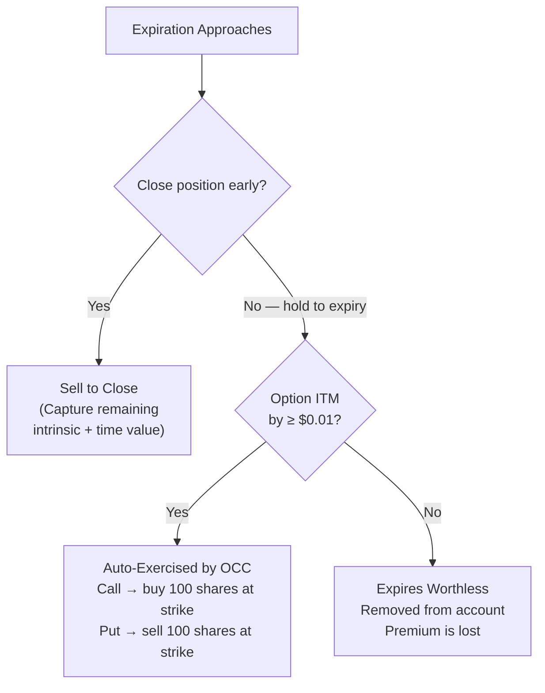

# Moneyness, Expiry, and the Two Ingredients of Every Option Price

In Module 1 you learned to read an options quote. You saw calls, puts, strikes, and premiums laid out in a chain. But one question probably nagged at you: why does a $170 call cost $17.50 while the $200 call on the same stock, same expiration, costs just $0.50?

By the end of this module, you will be able to look at any option price and explain exactly where each dollar comes from.

## Prerequisites

This module builds directly on Module 1: What Options Are. You should be comfortable with **call** and **put options**, the four key terms (**underlying asset**, **strike price**, **expiration date**, **premium**), **payoff diagrams**, and reading an **options chain**. If any of those feel shaky, revisit Module 1 before continuing.

A quick reminder: premiums are quoted per share, but each option contract controls 100 shares. A premium of $6.00 means the contract costs $600. Keep this multiplier in mind whenever you see dollar figures in this module.

## Moneyness -- Where Does Your Option Stand?

Imagine you hold a call option with a $180 strike on a stock trading at $185. If you could exercise that call right now, you would buy shares at $180 and they would be worth $185. That $5 gap means your option has immediate value. We say this option is **in the money** (abbreviated **ITM**).

Now imagine the strike is $190 instead. Exercising would mean buying at $190 when the stock is only $185. That makes no sense -- the option has no immediate exercise value. We say it is **out of the money** (**OTM**).

And if the strike equals the stock price exactly? That is **at the money** (**ATM**).

**Moneyness** is the relationship between the current stock price and the strike price. It answers one question: would this option be worth anything if you exercised it right now?[^1]

### Calls vs. Puts: The Direction Flips

<video controls width="100%"><source src="media/moneyness-expiry-time-value/MoneynessSweep.mp4" type="video/mp4">Your browser does not support video.</video>

Here is where beginners trip up. For calls, higher stock price relative to the strike means in the money. For puts, it is the opposite -- lower stock price means in the money, because a put gives you the right to *sell* at the strike.

| | Stock > Strike | Stock = Strike | Stock < Strike |
|---|---|---|---|
| **Call** (right to BUY) | ITM | ATM | OTM |
| **Put** (right to SELL) | OTM | ATM | ITM |

Notice the flip. A $190 strike with the stock at $185 is OTM for a call but ITM for a put. Same strike, same stock price, opposite moneyness -- because the rights are opposite.

### AAPL at $185: Seven Strikes

Let us make this concrete. Apple (AAPL) trades at $185. Here is how moneyness looks across seven call strikes:

| Strike | Stock Price | Relationship | Call Moneyness |
|--------|-------------|-------------|----------------|
| $170 | $185 | Stock > Strike by $15 | Deep ITM |
| $175 | $185 | Stock > Strike by $10 | ITM |
| $180 | $185 | Stock > Strike by $5 | ITM |
| $185 | $185 | Stock = Strike | ATM |
| $190 | $185 | Stock < Strike by $5 | OTM |
| $195 | $185 | Stock < Strike by $10 | OTM |
| $200 | $185 | Stock < Strike by $15 | Deep OTM |

For puts on the same strikes, every label flips: the $170 put is deep OTM, the $200 put is deep ITM.

**Deep ITM** options (typically $10 or more in the money) have prices that move nearly dollar-for-dollar with the stock.[^10] **Deep OTM** options are cheap long shots with a high probability of expiring worthless.[^11]

> **Misconception: "In the money means I'm making money."** Not necessarily. If you bought that $180 call for $8 and the stock is at $185, the option is ITM by $5 -- but you paid $8. You are still down $3. Moneyness describes the strike-vs-stock relationship, not your profit or loss. Your **max loss** as an option buyer is always limited to the premium you paid.[^7]

## Intrinsic Value -- The "Exercise Right Now" Value

Now that you understand moneyness, we can put a dollar figure on it.

**Intrinsic value** is the amount you would collect if you exercised the option and immediately reversed the stock trade at market price. It is the option's scrap value.[^4]

The key rule: intrinsic value can never be negative. If exercising would lose money, you would not exercise. The worst case is zero.

### The Formulas

Let us see the idea with numbers first, then write the general formula.

AAPL at $185, the $175 call: if you exercise, you buy at $175 and sell at $185. You pocket $185 - $175 = $10. That is the intrinsic value.

AAPL at $185, the $195 call: exercising means buying at $195, but the stock is only $185. You would lose $10 -- so you do not exercise. Intrinsic value is $0, not -$10.

Now the general formula:

- **Call intrinsic value** = max(Stock Price - Strike Price, 0)
- **Put intrinsic value** = max(Strike Price - Stock Price, 0)[^4][^8]

The max(..., 0) captures the "never negative" rule. You always have the choice to not exercise.

### Intrinsic Value Across Seven AAPL Strikes

| Strike | Stock Price | Call Intrinsic Value | Calculation |
|--------|-------------|---------------------|-------------|
| $170 | $185 | **$15** | max(185 - 170, 0) |
| $175 | $185 | **$10** | max(185 - 175, 0) |
| $180 | $185 | **$5** | max(185 - 180, 0) |
| $185 | $185 | **$0** | max(185 - 185, 0) |
| $190 | $185 | **$0** | max(185 - 190, 0) |
| $195 | $185 | **$0** | max(185 - 195, 0) |
| $200 | $185 | **$0** | max(185 - 200, 0) |

Notice the pattern: intrinsic value decreases dollar-for-dollar as the strike rises, then hits zero at ATM and stays there for every OTM strike.

The reader is encouraged to verify these calculations and then repeat them for the put side of the chain. For example: what is the intrinsic value of the $200 put? (Answer: max($200 - $185, 0) = $15.)

> **Misconception: "OTM options have negative intrinsic value."** They do not. Intrinsic value floors at zero. The formula uses max(..., 0) precisely because you would never choose to exercise at a loss. There is no such thing as negative intrinsic value.[^4]

## Time Value -- The Price of Possibility

If OTM options have zero intrinsic value, why do they cost anything at all? The $200 AAPL call has zero intrinsic value, yet it trades for $0.50.

That $0.50 is **time value** (also called **extrinsic value**) -- the portion of an option's price that reflects the *possibility* of favorable stock movement before expiration.[^4][^8]

Time value is the price of having time for circumstances to shift in your favor.

### Three Forces Drive Time Value

Three factors determine how large the time value component is[^8][^5]:

1. **Time remaining until expiration.** More time means more opportunity for the stock to move. A 90-day option has more time value than a 7-day option, all else equal.

2. **Uncertainty in the stock.** A volatile stock that swings 5% a week generates more time value than a stable stock that barely moves. (We will formalize this as "implied volatility" in Module 3.)

3. **Moneyness.** Of these three, moneyness is the one we can explore right now -- we just built the framework for it. ATM options have the most time value because they sit at the point of maximum uncertainty.[^3] A deep ITM call is almost certain to stay ITM -- little suspense. A deep OTM call is almost certain to stay OTM -- little hope. The ATM call could go either way, and that uncertainty is exactly what time value prices. Volatility and time-remaining effects will become clearer in Modules 3 and 7.

### Decomposing the AAPL Chain

<video controls width="100%"><source src="media/moneyness-expiry-time-value/PremiumDecomposition.mp4" type="video/mp4">Your browser does not support video.</video>

Now we can reveal what makes up each option's price. Here are realistic premiums for AAPL calls at $185 with 30 days to expiration:

| Strike | Premium | Intrinsic Value | Time Value | Moneyness |
|--------|---------|----------------|------------|-----------|
| $170 | $17.50 | $15.00 | $2.50 | Deep ITM |
| $175 | $13.50 | $10.00 | $3.50 | ITM |
| $180 | $9.50 | $5.00 | $4.50 | ITM |
| $185 | $6.00 | $0.00 | $6.00 | ATM |
| $190 | $3.50 | $0.00 | $3.50 | OTM |
| $195 | $1.50 | $0.00 | $1.50 | OTM |
| $200 | $0.50 | $0.00 | $0.50 | Deep OTM |

The time value column peaks at ATM ($6.00) and falls off in both directions. Maximum uncertainty lives at the ATM strike.

> **Misconception: "Time value means options gain value over time."** The opposite is true. Time value *erodes* as time passes. A better name might be "remaining-time premium" -- it is the price you pay for having time left, and each passing day takes a little of it away.[^5]

### The Put Side: NVDA at $800

To make sure the put-side logic sticks, let us walk through a different stock. NVIDIA (NVDA) trades at $800. You are considering protective puts at three strikes:

| Strike | Premium | Put Intrinsic Value | Time Value | Moneyness |
|--------|---------|-------------------|------------|-----------|
| $780 | $4.50 | $0 | $4.50 | OTM |
| $800 | $12.00 | $0 | $12.00 | ATM |
| $820 | $24.50 | $20.00 | $4.50 | ITM |

For puts, intrinsic value = max(Strike - Stock, 0). The $820 put is ITM: max($820 - $800, 0) = $20. The remaining $4.50 of its $24.50 premium is time value. The $780 put is OTM: its entire $4.50 premium is time value. Notice that the ATM $800 put has the highest time value ($12.00), just as we saw with calls.

This is the same pattern: time value peaks at ATM regardless of whether you are looking at calls or puts. The max loss for each put buyer is the premium paid (for example, $450 per contract for the $780 put, $2,450 per contract for the $820 put).

## Premium = Intrinsic Value + Time Value

We can now state the fundamental equation of option pricing:

> **Premium = Intrinsic Value + Time Value**[^4][^8]

This is not an approximation. It is a definition. Subtract intrinsic value from the premium; whatever remains is time value. Always.

This answers our opening question: the $170 call costs $17.50 because it carries $15 of intrinsic value plus $2.50 of time value. The $200 call costs $0.50 -- all time value, zero intrinsic. Most of the price difference is intrinsic value that you could extract right now by exercising.

We can verify this decomposition in Python:

```python
# Decompose AAPL call premiums (stock at $185, 30 days to expiration)
stock = 185
strikes  = [170,   175,   180,   185,   190,   195,   200]
premiums = [17.50, 13.50, 9.50,  6.00,  3.50,  1.50,  0.50]

print(f"{'Strike':>8} {'Intrinsic':>10} {'Time Val':>10} {'Premium':>10}")
print("-" * 42)
for strike, premium in zip(strikes, premiums):
    intrinsic = max(stock - strike, 0)
    time_val = premium - intrinsic
    print(f"  ${strike:>5}   ${intrinsic:>7.2f}   ${time_val:>7.2f}   ${premium:>7.2f}")

# Output:
#   Strike  Intrinsic   Time Val    Premium
# ------------------------------------------
#     $170     $15.00      $2.50     $17.50
#     $175     $10.00      $3.50     $13.50
#     $180      $5.00      $4.50      $9.50
#     $185      $0.00      $6.00      $6.00
#     $190      $0.00      $3.50      $3.50
#     $195      $0.00      $1.50      $1.50
#     $200      $0.00      $0.50      $0.50
```

The reader is encouraged to modify this snippet for the put side -- change `max(stock - strike, 0)` to `max(strike - stock, 0)` and test the same strikes.

### Same Strike, Three Dates

To isolate the effect of time, compare AAPL ATM calls ($185 strike, stock at $185) across three expirations:

| Expiration | Premium | Intrinsic Value | Time Value |
|-----------|---------|----------------|------------|
| 7 days | $3.50 | $0 | $3.50 |
| 30 days | $7.80 | $0 | $7.80 |
| 90 days | $14.20 | $0 | $14.20 |

All three are ATM (zero intrinsic value), so their entire premium is time value. The 90-day option costs about 4 times the 7-day option. Notice, however, that the relationship between time and premium is not strictly linear -- 90 days is roughly 13 times longer than 7 days, yet the premium is only about 4 times larger. As a rough rule of thumb, doubling the time to expiration increases time value by about 40%, not 100%. We will see why when we study the Greeks.

This also previews something important: if AAPL stays flat at $185, the 7-day option will lose almost all of its $3.50 in one week. The 90-day option will barely budge. Time value does not melt at a constant rate.

## How Expiration Works -- Three Choices

So far we have decomposed option prices into intrinsic and time value. But time value only exists because time remains. What happens when time runs out?

At expiration, the option's time value is gone. You are left with intrinsic value only (if any) -- or nothing.[^2][^12]

1. **Exercise** -- Convert your option into a stock trade. A call exercise means you buy 100 shares at the strike price. A put exercise means you sell 100 shares at the strike price. Your max gain on a long call is theoretically unlimited (the stock can rise without limit); your max gain on a long put is the strike price minus zero (if the stock falls to $0).

2. **Sell to close** -- Sell your option back to the market before expiration, capturing whatever premium remains (both intrinsic and time value).

3. **Let it expire** -- If your option is OTM, it expires worthless and disappears from your account. You lose the premium you paid, but nothing more.



### The OCC Auto-Exercise Rule

The Options Clearing Corporation (OCC) automatically exercises any option that finishes $0.01 or more ITM at expiration.[^2][^13] You do not need to call your broker. If you do *not* want auto-exercise (perhaps you lack the capital to buy 100 shares or do not want to take a stock position), you must submit a "Do Not Exercise" instruction before the deadline -- typically by 5:30 PM ET on the expiration date, though your broker will have the exact cutoff.

### American vs. European Exercise Style

Most U.S. equity options (stocks and ETFs) are **American-style**, meaning you can exercise them on any trading day before expiration, not just at expiration.[^12][^13] In practice, early exercise is uncommon -- selling to close almost always captures more value because you keep the remaining time value.

**European-style** options can only be exercised at expiration. You will encounter these most often with index options (such as SPX options on the S&P 500). The distinction matters less for beginners because most options you trade on individual stocks will be American-style, and even then you will rarely exercise early. But knowing the difference prevents confusion when you see index options behave slightly differently.[^12]

### Assignment: The Seller's Side

When a buyer exercises, the OCC randomly selects a seller (someone who is short that same option) and **assigns** them the obligation. A short call seller must deliver 100 shares. A short put seller must buy 100 shares.[^13] We will cover the mechanics of selling options in a later module, but it is good to know the term now.

### Most Traders Sell to Close

Approximately 70% of options are closed before expiration.[^12] About 7% are exercised. The rest expire worthless.[^13]

Why do so few get exercised? Two reasons. Exercising requires significant capital (enough to buy or sell 100 shares). And selling to close captures *both* intrinsic and time value, while exercising captures only intrinsic value. If any time value remains, selling is almost always the better move.

> **Misconception: "Exercise is the normal outcome."** It is not. Most traders sell their options before expiration to capture remaining time value. Exercise is relatively uncommon, especially among retail traders.[^12]

## Time Decay Preview -- The Clock Is Ticking

Time value erodes as expiration approaches. But how fast?

<video controls width="100%"><source src="media/moneyness-expiry-time-value/TimeDecayCurve.mp4" type="video/mp4">Your browser does not support video.</video>

Time value drains slowly when expiration is distant and then drops sharply in the final 30 days.[^5][^9]

From 90 to 60 days, time value drops from $14.20 to $11.10 -- a loss of $3.10. From 30 days to 0, it drops from $7.00 to $0 -- a loss of $7.00. The final month destroys more than twice the value of the first month.

**This has a practical consequence you can be right about direction and still lose money.** Suppose you buy a 10-day ATM call for $3.00 and the stock rises $1 over the next week. Your intrinsic value gained $1, but time value may have eroded $2. Net result: a loss despite being directionally correct.

We will formalize this decay rate as **theta** (one of the "Greeks") in Module 7. For now, the qualitative understanding is what matters: decay accelerates, and short-dated options are especially vulnerable.

## Common Mistakes

1. **Confusing moneyness with profitability.** An option can be ITM and still represent a losing trade. A $180 call purchased for $8 when the stock is at $185 is $5 ITM -- but you are down $3. Moneyness is about strike vs. stock price, not your P&L.

2. **Thinking OTM options have negative intrinsic value.** They do not. Intrinsic value floors at zero. The max(..., 0) in the formula exists precisely because you would never voluntarily exercise at a loss.

3. **Believing "time value" means the option gains value over time.** The name is misleading. Time value is the premium you pay for *having* time left. It shrinks every day. Think "remaining-time premium" instead.

4. **Assuming time decay is constant.** A 90-day option does not lose one-ninetieth of its time value each day. Decay is slow at first and accelerates sharply in the final 30 days. The curve bends, it does not slope evenly.

5. **Forgetting the 100-share multiplier.** That "$6.00" ATM option costs $600 per contract. The $170 call at $17.50 costs $1,750; the $200 call at $0.50 costs $50.

## Recap and What Comes Next

Let us pull together what we learned:

- **Moneyness** tells you where an option stands relative to the current stock price -- ITM, ATM, or OTM.
- **Intrinsic value** is the exercise-now value: max(S - K, 0) for calls, max(K - S, 0) for puts. It is never negative.
- **Time value** is the premium above intrinsic value -- the price of possibility. It peaks at ATM and erodes as expiration approaches.
- **Premium = Intrinsic Value + Time Value.** This equation lets you decompose any option price.
- Most traders **sell to close** rather than exercising. About 70% of options close before expiration.
- **Time decay accelerates** in the final 30 days. Being right about direction is not enough if decay eats your premium.
- U.S. equity options are **American-style** (exercisable any day), while index options are often **European-style** (exercisable only at expiration).

You can now look at any option price and explain where each dollar comes from.

But we left threads hanging. What exactly determines how much time value an option gets? Why does a volatile stock generate more time value than a calm one? How do interest rates play a role? Module 3 builds intuition for the forces -- volatility, time, and rates -- that drive option pricing, setting the stage for the Greeks.

## Try It Yourself

Before moving on to Module 3, open a real options chain and apply what you have learned:

1. Go to [Yahoo Finance](https://finance.yahoo.com), search for any stock, and click "Options."
2. Pick three call options at different strikes -- one ITM, one ATM, one OTM.
3. For each, calculate the intrinsic value using max(Stock Price - Strike, 0).
4. Subtract the intrinsic value from the quoted premium to find the time value.
5. Verify that time value peaks near the ATM strike.

If you want to go further, repeat the exercise for puts on the same stock. Does the pattern hold?

## Quiz

**Question 1:** AAPL is trading at $185. A $175 call option costs $14. What is the intrinsic value? What is the time value?

<details>
<summary>Answer</summary>

Intrinsic value = max($185 - $175, 0) = **$10**. Time value = Premium - Intrinsic = $14 - $10 = **$4**. The $175 call is $10 in the money, and the remaining $4 of the premium reflects time value.

</details>

**Question 2:** Same stock at $185, same expiration. The $190 call has a premium of $3.50 and the $180 call has a premium of $9.50. Which has more intrinsic value? Which has more time value?

<details>
<summary>Answer</summary>

The $180 call has more intrinsic value: max($185 - $180, 0) = **$5** (vs. $0 for the $190 call, which is OTM). For time value: $180 call TV = $9.50 - $5 = $4.50. The $190 call TV = $3.50 - $0 = $3.50. The **$180 call** also has more time value in this case. However, the $185 ATM strike (not shown here) would have the highest time value of all, because it sits at maximum uncertainty.

</details>

**Question 3:** You hold an ATM call with 5 days until expiration. The stock has not moved in a week. Has your option's value likely increased, decreased, or stayed flat? Why?

<details>
<summary>Answer</summary>

**Decreased.** An ATM option's premium is 100% time value, and ATM options experience the fastest absolute time decay. With only 5 days left, you are deep in the acceleration zone where decay is steepest. Even though the stock did not move (so intrinsic value is unchanged at $0), time value has been eroding rapidly. The option is worth less than it was a week ago.

</details>

**Question 4:** NVDA is trading at $800. A $820 put costs $24.50. What is the intrinsic value? What is the time value? Is this put ITM or OTM?

<details>
<summary>Answer</summary>

For a put, intrinsic value = max(Strike - Stock, 0) = max($820 - $800, 0) = **$20**. Time value = $24.50 - $20 = **$4.50**. The put is **ITM** because the strike ($820) is above the stock price ($800) -- the holder could exercise and sell shares at $820 when they are worth only $800.

</details>

## Glossary

- **Moneyness** -- The strike-vs-stock-price relationship. Determines ITM, ATM, or OTM status.
- **In the Money (ITM)** -- Has intrinsic value. Calls: stock > strike. Puts: stock < strike.
- **At the Money (ATM)** -- Strike equals (or is nearest to) the current stock price.
- **Out of the Money (OTM)** -- No intrinsic value. Calls: stock < strike. Puts: stock > strike.
- **Deep ITM / Deep OTM** -- Significantly ITM (typically $10+) or OTM. Deep ITM premiums are mostly intrinsic; deep OTM premiums are small and all time value.
- **Intrinsic Value** -- Exercise-now value. Call: max(S - K, 0). Put: max(K - S, 0). Never negative.
- **Time Value (Extrinsic Value)** -- Premium minus intrinsic value. Reflects possibility of favorable movement before expiration.
- **Exercise** -- Converting an option into a stock trade at the strike price.
- **Sell to Close** -- Selling your option before expiration to capture remaining premium.
- **Expire Worthless** -- OTM option reaches expiration and is removed with no value.
- **Automatic Exercise** -- OCC exercises any option $0.01+ ITM at expiration unless a Do Not Exercise instruction is filed.
- **Assignment** -- OCC obligates a randomly selected seller to fulfill an exercised contract.
- **Time Decay** -- Erosion of time value as expiration approaches. Non-linear: accelerates in the final 30 days.
- **American-Style** -- Option that can be exercised on any trading day before expiration. Most U.S. equity options are American-style.
- **European-Style** -- Option that can only be exercised at expiration. Common for index options (e.g., SPX).

---

[^1]: [Wikipedia - Moneyness](https://en.wikipedia.org/wiki/Moneyness)
[^2]: [E*TRADE - Understanding Expiration](https://us.etrade.com/knowledge/library/options/understanding-expiration)
[^3]: [Britannica Money - At the Money](https://www.britannica.com/money/at-the-money)
[^4]: [Macroption - Call Option Price, Intrinsic and Time Value](https://www.macroption.com/call-option-price-intrinsic-time-value/)
[^5]: [Nasdaq - Time Decay 101](https://www.nasdaq.com/articles/time-decay-101-how-it-affects-options-trading)
[^7]: [CME Group - Calculating Options Moneyness & Intrinsic Value](https://www.cmegroup.com/education/courses/introduction-to-options/calculating-options-moneyness-and-intrinsic-value)
[^8]: [Fidelity - Understanding Options Pricing](https://www.fidelity.com/learning-center/trading-investing/understanding-options-pricing)
[^9]: [TradingBlock - Option Theta Time Decay](https://www.tradingblock.com/blog/option-theta-time-decay)
[^10]: [Nasdaq - How Deep in the Money Call Options Work](https://www.nasdaq.com/articles/how-deep-money-call-options-work)
[^11]: [SoFi - In the Money vs Out of the Money](https://www.sofi.com/learn/content/in-the-money-vs-out-of-the-money/)
[^12]: [OCC Options Education - Options Exercise FAQ](https://www.optionseducation.org/referencelibrary/faq/options-exercise)
[^13]: [FINRA - Trading Options: Understanding Assignment](https://www.finra.org/investors/insights/trading-options-understanding-assignment)


