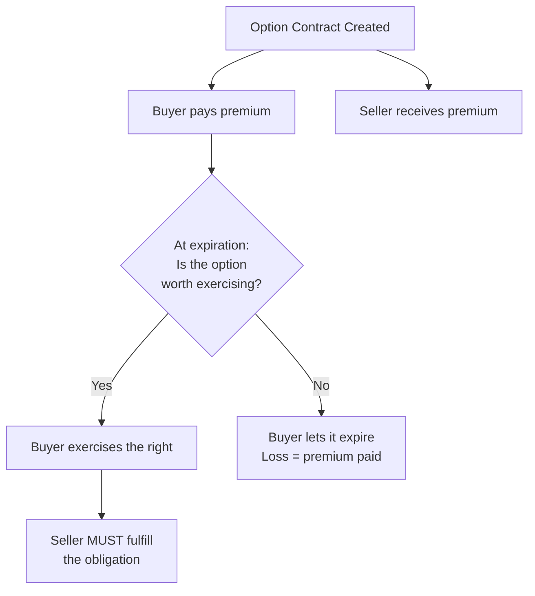

# What Options Are — Calls, Puts, and Payoff Intuition

## The Problem Worth Solving

Imagine you could lock in today's price on anything — a house, a car, a stock — and *choose later* whether you actually want to buy it. If the price shoots up, you can buy at the old price. If it crashes, you walk away. That is exactly what an options contract lets you do.

This article teaches you what options are, how they work, and how to read a basic options quote. By the end, you will be able to read a payoff diagram for a long call or long put and calculate your breakeven price.

## What You Need First

This is Module 1 of a 15-module course that ends at Black-Scholes pricing. You need three things before starting:

1. **What a stock is** — owning a share means owning a piece of a company, and that share has a price.
2. **Buy/sell basics** — you can buy something hoping it goes up and sell it later; the difference is your profit or loss.
3. **Market price** — assets have a current price that changes over time based on supply and demand.

If those three concepts feel familiar, you are ready.

## What Is a Derivative?

Before we get to options, we need one piece of vocabulary. A **derivative** is a financial contract whose value comes from something else. That "something else" is called the **underlying asset**.

An option is a specific type of derivative. When you buy an option on Apple stock, you do not own Apple shares. You own a *contract about* Apple shares. The contract's value rises and falls based on what Apple's stock price does.

> This idea is ancient. Around 600 BCE, Thales of Miletus paid olive press owners for the exclusive right to use their presses during the next harvest. Large harvest? He rented them at a profit. Small harvest? He lost only what he paid upfront. That is the same payoff structure you will see throughout this article — limited loss, scalable gain.[^8] Modern standardized options trading began in 1973 with the founding of the Chicago Board Options Exchange (CBOE).[^8]

## The Four Key Terms

Every options contract has exactly four terms. Once you know them, you can read any options quote on any platform.

Let's make this concrete with a house purchase before we get abstract.

### The house deposit analogy

You find a house listed at $300,000. You pay the seller $5,000 for the exclusive right to buy it at that price within the next 90 days. Here is how the four terms map:

| Term | In the analogy | In options language |
|---|---|---|
| **Underlying asset** | The house | The stock (e.g., AAPL) |
| **Strike price** | $300,000 (the locked-in purchase price) | The price at which you can buy or sell |
| **Expiration date** | 90 days from now | The deadline to act |
| **Premium** | $5,000 (the deposit) | What you pay for the contract |

Let's define each one precisely.

The **underlying asset** is the security the option gives you the right to buy or sell — for example, shares of Apple (AAPL).[^1][^3]

The **strike price** (also called the exercise price) is the fixed price written into the contract. It does not change during the life of the option.[^3][^5]

The **expiration date** is the deadline. After this date, the contract is void. Exercise it, sell it, or lose it.[^3][^4]

The **premium** is the price of the option itself — what you pay to buy it (or what you receive if you sell it). This is the option's market price, and it fluctuates over time just like a stock price does. (We will explain *why* premiums change in Module 3, when we cover time value and the Greeks.)[^1][^4]

A quick note on exercise styles: most stock options in the U.S. are **American-style**, meaning you can exercise any time before expiration. **European-style** options, common on index options like SPX, can only be exercised on the expiration date itself. This course focuses on American-style unless stated otherwise.[^18]

### The 100-share multiplier

Here is a detail that trips up every beginner. One standard equity options contract covers **100 shares** of the underlying stock.[^4][^7] The premium you see quoted is *per share*.

So when you see a premium of $3.50, you are not paying $3.50. You are paying $3.50 x 100 = **$350** for the contract. Every time you see a premium in this course, multiply by 100 to get the actual dollar cost.

## Call Options — The Right to Buy

A **call option** gives you the right — but not the obligation — to *buy* the underlying at the strike price before expiration.[^1][^4] You buy a call when you think the stock is heading up.

Let's revisit the house analogy. You paid $5,000 (premium) to lock in a $300,000 purchase price (strike) for 90 days (expiration). Three months later:

**Scenario A: The house appreciates to $350,000.** You exercise your right and buy at $300,000. You save $50,000 compared to the market price, minus the $5,000 deposit. Net gain: $45,000.

**Scenario B: The house drops to $250,000.** Why would you buy a $250,000 house for $300,000? You would not. You walk away. Your loss is the $5,000 deposit and nothing more.

**Scenario C: The house is worth exactly $305,000.** You exercise, saving $5,000 compared to market — but you spent $5,000 on the deposit. You break even.

Notice the word "option" is literal. You have the *choice* to buy. Nobody forces you.

**Max gain and max loss for a long call:** Your maximum loss is the premium paid — that is it. Your maximum gain is theoretically unlimited, because the stock price can rise without bound.[^2][^9]

> **Misconception: "If I buy a call, I have to buy the stock."** No. If exercising would lose you money, you simply let the option expire. That is the whole point — you pay a premium for the *right to choose*.

## Put Options — The Right to Sell

A **put option** gives you the right — but not the obligation — to *sell* the underlying at the strike price before expiration.[^1][^4] You buy a put when you think the stock is heading down, or when you want to protect shares you already own.

### Why puts exist: from olive presses to coffee beans

Remember Thales locking in the right to *use* olive presses? Now flip the perspective. Imagine you are an olive farmer. You have spent the whole growing season tending your crop, and you are worried that olive prices might collapse before harvest. You go to a merchant and pay a small fee for the right to *sell* your olives at today's price, no matter what happens by harvest time.

If prices crash, you sell at the guaranteed price and avoid disaster. If prices stay high or rise, you ignore the deal and sell on the open market — you lose only the fee you paid. That is a put option. The fee is the premium, today's price is the strike, and the harvest date is the expiration.

This is not just an analogy — it is how agricultural options actually work. Coffee roasters, wheat farmers, and airline fuel buyers use options contracts to manage exactly this kind of price risk every day.

Suppose you own shares of a stock trading at $50. You buy a $45 put for $3 per share ($300 total). If the stock drops to $30, you can still sell at $45. Your put pays off ($45 - $30) x 100 = $1,500. After subtracting the $300 premium, you netted $1,200 from the put. Meanwhile, your stock lost ($50 - $30) x 100 = $2,000. Your total portfolio loss: $2,000 - $1,200 = **$800** (the $300 premium is already included in that $1,200 net figure) — far better than the $2,000 loss you would have taken without the put.

If the stock stays above $45, the put expires worthless. You lost $300, just like a farmer's hedging fee in a year when prices held up.

**Max gain and max loss for a long put:** Your maximum loss is the premium paid. Your maximum gain is the strike price minus the premium (per share), because the stock cannot fall below zero. For the example above: ($45 - $3) x 100 = $4,200.[^2][^9]

> **Misconception: "You need to own the stock to buy a put."** Not true. You can buy a put purely as a bet that the stock will fall, even without owning a single share. Owning stock *and* buying a put is called a protective put — that is the hedging version — but it is not the only way.[^10]

## Buyer vs Seller — Rights vs Obligations

Every options trade has two sides. The **buyer** (also called the **holder**) pays the premium and receives a *right*. The **seller** (also called the **writer**) collects the premium and takes on an *obligation*.[^1]

The buyer-seller distinction is the part of options that takes the longest to internalize. If it does not click on your first read, that is normal — come back to it after reading the payoff section below.

The buyer's worst case is losing the premium. The seller's worst case can be much larger — for a call seller, losses are theoretically unlimited because the stock can rise without bound; for a put seller, losses are capped only because the stock cannot fall below zero. For every option buyer there is an option seller — the Options Clearing Corporation (OCC) acts as the intermediary guaranteeing both sides.[^7]

There are exactly four basic positions:

| Position | Right or Obligation? | Pays or Receives Premium? | Market View |
|---|---|---|---|
| **Long call** (buy a call) | Right to buy | Pays | Bullish |
| **Short call** (sell a call) | Obligation to sell | Receives | Bearish / Neutral |
| **Long put** (buy a put) | Right to sell | Pays | Bearish |
| **Short put** (sell a put) | Obligation to buy | Receives | Bullish / Neutral |

For quick risk intuition, here is the payoff profile of each position at expiration:

| Position | Max Gain | Max Loss | Breakeven |
|---|---|---|---|
| **Long call** | Theoretically unlimited | Premium paid | Strike + Premium |
| **Short call** | Premium received | Theoretically unlimited | Strike + Premium |
| **Long put** | Strike - Premium (per share) | Premium paid | Strike - Premium |
| **Short put** | Premium received | Strike - Premium (per share) | Strike - Premium |

To make the seller's obligation concrete: suppose you sell an AAPL $150 call and collect a $4 premium ($400 total). If AAPL rises to $170, the buyer exercises, and you *must* sell shares at $150 — $20 below the market price. Your loss: ($20 - $4) x 100 = $1,600. The $400 premium you collected cushions the blow, but it does not come close to covering it.

The flowchart below shows the decision path:

Think of the seller as a landlord who signs a fixed-price lease. If market rents skyrocket, the landlord is locked into the old rate — that is the obligation side. The landlord accepted that risk in exchange for guaranteed rental income upfront (the premium). Sellers accept the risk of obligation in exchange for premium income, and many are sophisticated hedgers managing large portfolios — not gamblers hoping to get lucky. We will cover seller strategies in Module 6.

> **Misconception: "Selling options is free money because you collect premium."** The premium is compensation for risk, not a gift. If the stock moves sharply against a seller, losses can far exceed the premium collected.[^9]

## Payoff Diagrams — The Hockey Stick

A **payoff diagram** answers one question: *at every possible stock price on expiration day, how much did I make or lose?*

The horizontal axis is the stock price at expiration. The vertical axis is profit or loss. For option buyers, the shape looks like a hockey stick — flat on one side (loss capped at the premium) and sloping on the other (profit grows as the stock moves your way).[^14]

Before reading the next section, try this: grab a piece of paper and sketch what you think a long call payoff looks like. Where is it flat? Where does it start sloping up? Where is the breakeven? Compare your sketch to the diagram below.

### Long call payoff

<video controls width="100%"><source src="media/options-payoffs/LongCallPayoff.mp4" type="video/mp4">Your browser does not support video.</video>

Below the strike price ($145), the call expires worthless. You lose the $8 premium — the flat blade of the hockey stick. Above $145, the option starts to have value, and above $153 (strike + premium) you are in profit — the rising shaft of the stick.

### Long put payoff

<video controls width="100%"><source src="media/options-payoffs/LongPutPayoff.mp4" type="video/mp4">Your browser does not support video.</video>

Above the strike price ($145), the put expires worthless. You lose the $8 premium. Below $145, the option gains value, and below $137 (strike minus premium) you are in profit.

### Worked example: AAPL $145 call at $8

Let's walk through a specific trade. You buy one AAPL $145 call and pay $8 per share ($800 total). At expiration, here are three scenarios:

**Scenario 1: AAPL is at $140 (below the strike).** The option expires worthless. Your loss: $8 per share, or $800 total.

**Scenario 2: AAPL is at $150 (above the strike, but below breakeven).** The option has $5 of exercise value ($150 - $145), but you paid $8 for it. Your net P/L: $5 - $8 = **-$3 per share**, or -$300 total. The option is **in the money** but you still lost money.

**Scenario 3: AAPL is at $160 (above breakeven).** The option has $15 of exercise value ($160 - $145). You paid $8. Your profit: $15 - $8 = **$7 per share**, or $700 total.

### Breakeven formulas

Now that the intuition is clear, here are the formulas:

- **Long call breakeven** = Strike price + Premium paid
- **Long put breakeven** = Strike price - Premium paid

For our AAPL call: $145 + $8 = **$153**. The stock must rise above $153 for you to profit.

> **Misconception: "If a call is in the money, I made a profit."** Not necessarily. In Scenario 2 above, the option was in the money (stock $150 > strike $145) but you still lost $3 per share because you paid $8 in premium. **In the money** means the option has exercise value. **Profitable** means that exercise value exceeds what you paid.[^9][^13]

## Reading an Options Quote

Let's put everything together. Here is a typical options quote:

> **AAPL Sep 18 2026 $200 Call @ $8.50**

Decoded:

| Piece | Meaning |
|---|---|
| AAPL | Underlying asset: Apple stock |
| Sep 18 2026 | Expiration date |
| $200 | Strike price |
| Call | Type: right to buy |
| $8.50 | Premium per share ($850 total for 1 contract) |

On a real platform (Yahoo Finance, your brokerage, or sites like Barchart), you will see an **options chain** — a table displaying many strikes and expirations at once. Here is what a slice of one looks like:

| Calls Bid | Calls Ask | Calls Last | Calls Vol | Strike | Puts Bid | Puts Ask | Puts Last | Puts Vol |
|---|---|---|---|---|---|---|---|---|
| 12.40 | 12.75 | 12.55 | 1,204 | **195** | 2.10 | 2.30 | 2.20 | 856 |
| 8.30 | 8.60 | 8.50 | 3,782 | **200** | 3.90 | 4.15 | 4.00 | 2,115 |
| 5.10 | 5.35 | 5.20 | 2,450 | **205** | 6.50 | 6.80 | 6.65 | 1,340 |

A few columns worth knowing:

- **Bid**: the highest price a buyer is currently willing to pay.[^15]
- **Ask**: the lowest price a seller is currently willing to accept.[^15]
- **Last**: the price of the most recent trade. This can be stale if the option has not traded recently.[^16]
- **Volume (Vol)**: how many contracts have traded today.[^16]
- **Open interest**: the total number of contracts currently open (not yet closed or expired). Not shown in every view, but important for gauging activity.[^16]

The gap between bid and ask is the **bid-ask spread**. Tight spread = liquid (many buyers and sellers, easy to trade at a fair price). Wide spread = fewer participants, harder to get a fair price.[^16]

### Try It Yourself

Open [Yahoo Finance](https://finance.yahoo.com), search for AAPL, and click the **Options** tab. Find a call option with a strike price near the current stock price. Then:

1. Identify the four key terms: underlying, strike, expiration, premium (use the "Ask" price as the premium).
2. Calculate the breakeven: strike + ask price.
3. Look at the bid-ask spread. Is it tight (a few cents) or wide (a dollar or more)?
4. Check the volume column. Has this option traded much today?

If you can do all four, you have the practical vocabulary to navigate any options chain.

## Common Mistakes

Five mistakes nearly every beginner makes:

1. **Confusing premium with strike price.** The strike is the buy/sell price of the stock. The premium is the price of the option itself. They are different numbers, and the premium is much smaller.

2. **Thinking "in the money" means "profitable."** An ITM option can still be a net loss if you paid more in premium than the exercise value. Always check the breakeven.

3. **Forgetting the 100x multiplier.** A $4 premium costs $400, not $4. This trips up every beginner on their first trade.

4. **Believing you must exercise to profit.** Many option positions are closed before expiration by selling the contract back into the market, rather than exercised. You can sell your option to someone else at any time before expiration, just like selling a stock.

5. **Ignoring time.** An option can lose money even if the stock moves in the right direction — if it does not move far enough, fast enough. The premium you paid included a charge for time remaining, and that charge shrinks every day. This is called **time decay**, and we will cover it in detail in Module 3.

## Glossary

| Term | Definition |
|---|---|
| **Derivative** | A contract whose value is derived from an underlying asset. |
| **Underlying asset** | The security (stock, ETF, index) an option is based on. |
| **Strike price** | The fixed price at which the holder can buy or sell the underlying. |
| **Expiration date** | The deadline to exercise the option. |
| **Premium** | The price of the option contract itself. |
| **Call option** | Right to buy the underlying at the strike price. |
| **Put option** | Right to sell the underlying at the strike price. |
| **Holder (buyer)** | The party who pays the premium and holds the right. |
| **Writer (seller)** | The party who receives the premium and bears the obligation. |
| **American-style** | Can be exercised any time before expiration (most U.S. stock options). |
| **European-style** | Can be exercised only on the expiration date (common for index options). |
| **In the money (ITM)** | Call: stock > strike. Put: stock < strike. |
| **Out of the money (OTM)** | Call: stock < strike. Put: stock > strike. |
| **At the money (ATM)** | Stock price approximately equals the strike price. |
| **Payoff diagram** | Chart of profit/loss at every possible stock price at expiration. |
| **Breakeven** | Stock price at which the trade produces zero profit/loss. |
| **Bid-ask spread** | Gap between what buyers offer and sellers accept. |
| **Open interest** | Total outstanding contracts not yet closed or expired. |
| **Volume** | Number of contracts traded in a given period. |
| **Time decay** | The gradual loss of an option's time-related value as expiration approaches (Module 3). |

## Quiz

Test your understanding with these four questions. Work them out before checking the answers.

**Question 1:** You buy an AAPL $145 call for $8 per share. At expiration, AAPL is trading at $150. What is your profit or loss per share?

Answer

**Loss of $3 per share** ($300 total). The option's exercise value is $150 - $145 = $5. You paid $8 in premium. Net P/L: $5 - $8 = **-$3 per share**. The option is in the money, but you still lost money because the premium exceeded the exercise value.

**Question 2:** True or False: A put *seller* has the right to sell stock at the strike price.

Answer

**False.** A put seller has the *obligation to buy* stock at the strike price if the put buyer exercises. It is the put *buyer* who has the right to sell. Sellers have obligations, not rights.

**Question 3:** You buy a $50 put for $2 per share. What is the breakeven stock price, and what is your maximum possible gain per share?

Answer

**Breakeven: $48.** Long put breakeven = strike price - premium = $50 - $2 = **$48**. The stock must fall below $48 for you to profit.

**Max gain: $48 per share** ($4,800 per contract). The most a stock can fall is to $0. At $0, the put's exercise value is $50 - $0 = $50. Subtract the $2 premium: $50 - $2 = **$48 per share**.

**Question 4:** You see this options quote: **MSFT Dec 18 2026 $420 Put @ $11.20**. What is the underlying asset, the strike price, the expiration, the type, and the total cost of one contract?

Answer

- **Underlying**: Microsoft (MSFT)
- **Strike price**: $420
- **Expiration**: December 18, 2026
- **Type**: Put (right to sell)
- **Total cost**: $11.20 x 100 = **$1,120** for one contract
- **Breakeven**: $420 - $11.20 = **$408.80** (stock must fall below this for the put to profit)

## Recap and What Comes Next

Five big ideas from this module:

1. **An option is a contract about a stock, not the stock itself.** Its value derives from the underlying asset.
2. **Four terms define every option**: underlying, strike, expiration, and premium.
3. **Calls = right to buy. Puts = right to sell.** Neither forces you to do anything.
4. **Buyers have rights. Sellers have obligations.** Buyers pay a premium to choose. Sellers collect it but must deliver if called upon.
5. **Payoff diagrams are your best friend.** The hockey stick tells you what you make or lose at every price. Always check the breakeven.

In Module 2, we go deeper into **moneyness** — the relationship between stock price and strike price — and introduce **time value**, the part of the premium that reflects time remaining before expiration. These two concepts explain *why* premiums change moment to moment, and they set the foundation for everything ahead.

---

## References

[^1]: FINRA, "Options," [finra.org/investors/investing/investment-products/options](https://www.finra.org/investors/investing/investment-products/options).

[^2]: Schwab, "Basic Call and Put Options Strategies," [schwab.com/learn/story/basic-call-and-put-options-strategies](https://www.schwab.com/learn/story/basic-call-and-put-options-strategies).

[^3]: SoFi, "Strike Price: What It Means for Options Trading," [sofi.com/learn/content/strike-price-options-trading](https://www.sofi.com/learn/content/strike-price-options-trading/).

[^4]: Fidelity, "What Are Options and How Do They Work?" [fidelity.com/learning-center/smart-money/what-are-options](https://www.fidelity.com/learning-center/smart-money/what-are-options).

[^5]: Vanguard, "What Are Call and Put Options?" [investor.vanguard.com/investor-resources-education/understanding-investment-types/what-are-call-put-options](https://investor.vanguard.com/investor-resources-education/understanding-investment-types/what-are-call-put-options).

[^7]: Longbridge, "U.S. Stock Options Contract Specifications: The 100-Share Standard," [longbridge.com/en/academy/options/blog/100041](https://longbridge.com/en/academy/options/blog/100041).

[^8]: Cboe, "History of Cboe," [cboe.com/about/history](https://www.cboe.com/about/history/).

[^9]: Analyst Prep, "Call & Put Option Payoff Charts + Formulas," [analystprep.com/blog/options-calculations-payoff-profit](https://analystprep.com/blog/options-calculations-payoff-profit/).

[^10]: Cabot Wealth, "How to Protect Your Portfolio with Put Options," [cabotwealth.com/daily/options-trading/insure-investment-portfolio-put-options](https://www.cabotwealth.com/daily/options-trading/insure-investment-portfolio-put-options).

[^13]: Macroption, "Call Option Payoff Diagram, Formula and Logic," [macroption.com/call-option-payoff](https://www.macroption.com/call-option-payoff/).

[^14]: Faston, "Hockey Sticks: Basics of Standard Options," [faston.se/insights/hockey-sticks-standard](http://faston.se/insights/hockey%20sticks%20standard.html).

[^15]: Bankrate, "Options Chain: How to Read and Understand Them," [bankrate.com/investing/options-chain](https://www.bankrate.com/investing/options-chain/).

[^16]: Tackle Trading, "Options 101: Bid/Ask, Open Interest and Volume," [tackletrading.com/options-101-bidask-open-interest-and-volume](https://tackletrading.com/options-101-bidask-open-interest-and-volume/).

[^18]: CME Group, "Understanding the Difference: European vs American Style Options," [cmegroup.com/education/courses/introduction-to-options/understanding-the-difference-european-vs-american-style-options](https://www.cmegroup.com/education/courses/introduction-to-options/understanding-the-difference-european-vs-american-style-options).

